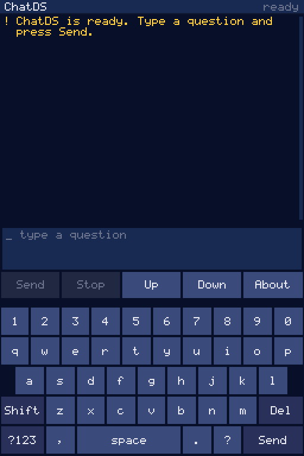

# chatds

chatds runs a tiny chat model on a nintendo ds lite. no network, phone or pc.
type on the touchscreen; the 67 MHz ARM9 looks up facts on the SD card,
evaluates `calc(...)` calls and writes short python or shell snippets.
the current model has 2.75 million parameters. it gets things wrong a lot.



the gif uses the independent engine in headless melonDS with scripted touch
input. playback is accelerated, not a speed measurement.
[capture provenance](docs/demo.json).

## measured speed

**emulated DS timer measurements**, not host wall time or physical DS timings.
resident DSQ8 weights, int16 Q8.8 KV, context 256, frozen KB2 assets. the full
product ROM includes the tokenizer, retrieval, calculator and touch UI.

| question | first token | decode steps/s | total |
|---|---:|---:|---:|
| who was george washington | 12.314 s | 3.405 | 17.599 s |
| whats 38 times 47 | 3.522 s | 3.631 | 6.551 s |
| sort scores biggest first | 3.522 s | 3.613 | 8.227 s |

these complete runs were **2.68–2.74× faster** than the historical black-box
baseline. first token includes retrieval, tokenization and prefill; excludes
model loading and screen refresh. decode throughput includes the EOS prediction,
not generated tokens divided by the whole run. largest main-RAM heap-break
proxy: **3,653,632 bytes**. this is not a stack or live-allocation peak.
[method, binary hashes and raw results](docs/ENGINE-BENCHMARK.md).

## build

linux, `make`, a C compiler, python 3 and
[BlocksDS](https://blocksds.github.io/docs/) are required.

```sh
bash tools/install-blocksds.sh  # installs into ~/opt/wonderful
source tools/env.sh
make                           # clean/product/build/chatds.nds
make host                      # clean/product/build/chatds-host
```

weights and the fact index are **not included**. supply a compatible resident
DSQ8 model and its matching tokenizer. the current model file is 2,986,240 bytes;
the release KB3 index is 42,321,808 bytes. redistribution rights remain under
review. model shape is read from the file, not baked into the ROM. unsupported
layouts, mismatched vocabulary sizes and malformed files are refused.

```sh
bash ds/hwkit/make-kit.sh --mode assistant \
  --model path/to/model.bin --tokenizer path/to/tok.bin \
  --kb path/to/kb.bin --kb-attribution path/to/ATTRIBUTION.txt \
  --prompt 'whats 38 times 47' --out build/chatds-kit

bash ds/hwkit/smoke-test.sh "$PWD/build/chatds-kit"
```

omit both KB options to run without fact retrieval. packaging stages files;
it never writes a physical card. smoke tests need the melonDS 1.1 Flatpak
(`net.kuribo64.melonDS`), `mtools` and `dosfstools`. they run offscreen and compare
IDs, stop, context, text and calculator results against the clean host.

## tokenizer assets

no trained tokenizer models are shipped. use UTF-8 text you have rights to use:

```sh
python3 -m pip install sentencepiece
python3 tools/train_tokenizer.py --input path/to/your-text.txt \
  --prefix build/my-tokenizer --vocab-size 2048
python3 ds/tokenizer/tokbin.py build/my-tokenizer.model build/tok.bin
```

this trains a **new** tokenizer, not the tokenizer used by existing weights.
train your model with that exact `.model`, or obtain a matching licensed
tokenizer from your weight provider. matching vocabulary sizes alone is not
enough. [training instructions](train/README.md) describe checkpoint training;
a device-format converter is not included. host tests generate small synthetic
tokenizers locally and need no pretrained assets.

## run

use a DS lite with a DLDI flashcart; DSpico is the intended target. back up the
card, then copy `chatds.nds` and `chatds/` from the kit to its root. don't replace
the flashcart bootloader. eject cleanly and launch `chatds.nds`.

- touch **Send**, keyboard return or **START** to ask.
- **B** or **Stop** cancels between engine steps. **Up/Down** scrolls.
- **About** or **SELECT** opens credits. **Bksp** deletes a character.
- input is ASCII, at most 127 bytes. each question starts fresh; no conversation memory.

results go to `chatds/out.txt`, `ids.txt`, `ctx.txt`, `calc.txt` and `heap.txt`.
`status=OK` means inference and file writes completed, not that the answer is
correct. python and shell answers are text, never executed. see
[kit/emulator setup](ds/hwkit/README.md) for melonDS use.

## test and develop

```sh
python3 -m pip install pytest numpy sentencepiece
make test
make -C clean sanitize
make -B -C clean/ui SAN=1 test
python3 eval/score.py --selftest
python3 eval/score.py --negative-selftest
```

host tests use synthetic models and a small KB fixture. optional training tests
report missing MIT training dependencies rather than silently claiming coverage.
[training](train/README.md), [corpus tools](corpus/README.md),
[clean host evaluation](eval/README.md) and [device compatibility](docs/ENGINE-GOLDEN.md).

## limits and licenses

facts can retrieve the wrong article. names get garbled; answers can be invented.
the product retains 31/33 frozen compatibility behaviors, including five clean
oversized-input rejections. two numerical differences have exact pinned outputs;
[details](docs/ENGINE-SWAP-INVESTIGATION.md). no physical DS timing or stack-canary
run has been completed for this clean product.

ChatDS code is MIT-licensed; see [LICENSE](LICENSE).
[release audit](docs/PUBLIC_RELEASE_AUDIT.md) records
remaining data and binary-release gates. no model download is offered yet.

BlocksDS/libnds and its runtime retain their own licenses. Wikipedia-derived
index/context data is CC BY-SA 4.0; TinyStories tokenizer-training data is
CDLA-Sharing-1.0. optional training uses the MIT llama2.c/ds-llm fork and nanoGPT
configurator. melonDS is GPLv3 and is a test tool, not shipped in the kit.
DSpico firmware/DLDI is by the LNH team.
[third-party notices](THIRD_PARTY_NOTICES.md).
